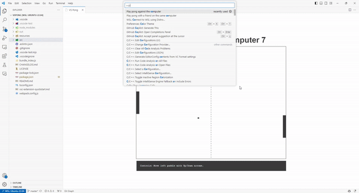

# VSPONG

Lose your productivity with this VSCode extension that lets you play pong in your editor!

## Features

Play pong in your vscode editor!

Available commands:

- `vspong.pongSingleplayer`: Play pong against a bot.
- `vspong.pongLocalMultiplayer`: Play pong against a friend on the same computer.
- `vspong.pongRemoteMultiplayerCreate`: Create a game and play against a friend online.
- `vspong.pongRemoteMultiplayerJoin`: Join a game created by a friend and play against them online.

## Extension Settings

This extension contributes the following settings:

* `vspong.username`: Set your username for aesthetic purposes.

## Let me see it in action!

### Singleplayer

### Create a game

### Join a game

### Change colors

The colors of the paddles and the ball change depending on the theme you are using!

